<div align="center">
  
</div>

<div align="center">
  
</div>

<p align="center">
  <a href="https://linkedin.com/in/anuj-sharrma"></a>
  <a href="mailto:sharrma26@gmail.com"></a>
  <a href="https://github.com/AnujSharrma08"></a>
</p>

---

## 🚀 About Me

```javascript
const anuj = {
    name: "Anuj Sharrma",
    location: "Pune, India 🇮🇳",
    role: "Full-Stack Developer",
    education: "Master’s in Computer Science",
    code: ["JavaScript", "Python", "SQL"],
    technologies: {
        frontend: [
            "React.js",
            "Next.js",
            "React Native",
            "Tailwind CSS",
        ],
        backend: [
            "Node.js",
            "Express.js",
            "FastAPI"
        ],
        databases: [
            "MySQL",
            "PostgreSQL"
        ],
        devOps: [
            "Docker (basic)",
            "AWS EC2",
            "Vercel"
        ],
        tools: [
            "Git",
            "GitHub",
            "Postman",
            "VS Code",
        ]
    },
    currentFocus: [
        "System Design",
        "Backend Scalability",
        "Micro-Service Architecture",
        "Cloud Computing in (AWS)"
    ],
    availability: "Open to remote & hybrid opportunities",
    funFact: "I still trust console.log() before any debugger 😄"
};
```

<div align="center">
  
</div>

---

## 🛠️ Tech Stack

<div align="center">

### Frontend


### Backend


### Database


### DevOps & Tools


</div>

---

## 💼 Featured Projects

<table>
<tr>
<td width="50%" valign="top">

### 🤖 adVantage AI — Production AI Platform


**AI-driven production-ready application deployed on AWS.**

**🎯 Key Features:**
- ✅ Next.js frontend with FastAPI backend
- ✅ Deployed on AWS (EC2, S3, RDS)
- ✅ Secure API & scalable backend design
- ✅ CI/CD pipeline using GitHub Actions
- ✅ Production-grade architecture

🔗 **Live:** `<your-live-url>`  
📂 **Repo:** `<your-repo-url>`

</td>

<td width="50%" valign="top">

### 🧠 Rescheduler AI — Optimization System


**AI-based scheduling engine to optimize machine usage & workforce.**

**🎯 Key Features:**
- ✅ Intelligent rescheduling based on priority & breakdowns
- ✅ Penalty cost & human workload optimization
- ✅ Constraint solving using Google OR-Tools (CP-SAT)
- ✅ FastAPI-powered optimization engine
- ✅ Real-world industrial use case

🔗 **Live:** `<your-live-url>`  
📂 **Repo:** `<your-repo-url>`

</td>
</tr>

<tr>
<td width="50%" valign="top">

### 🚀 Actively Building


**Currently working on:**
- 🔨 Real-time Chat Application (WebSockets)
- 🔨 Scalable Microservices Architecture
- 🔨 Advanced Backend System Design

📌 **Focus:** performance, scalability & clean architecture

</td>
</tr>
</table>

---

## 📊 GitHub Analytics

<div align="center">
  
  
</div>

<div align="center">
  
</div>

<div align="center">
  
</div>

---

## 🏆 GitHub Trophies

<div align="center">
  
</div>

---

## 📈 Contribution Graph

<div align="center">
  
</div>

---

## 💡 What I'm Currently Working On

```mermaid
graph LR
    A[Learning] --> B[System Design]
    A --> C[Microservices]
    A --> D[Cloud Architecture]
    B --> E[Building Scalable Apps]
    C --> E
    D --> E
    E --> F[Career Growth 🚀]
```



---

## 🎯 2025 Goals

- 🎓 Master System Design & Scalability
- 🏗️ Build 3 production-level projects
- 🌐 Contribute to 5 open-source projects
- 📝 Write 10 technical blogs
- 🤝 Collaborate with global developers
- 💼 Land an amazing Full-Stack role

---

## 📫 Let's Connect!

<div align="center">

### 💬 I'm always open to interesting conversations and collaboration opportunities!

<a href="https://linkedin.com/in/anuj-sharrma">
  
</a>
<a href="mailto:your.email@example.com">
  
</a>

### 📧 Email: **your.email@example.com**
### 💼 LinkedIn: **[Anuj Sharma](https://linkedin.com/in/anuj-sharrma)**

</div>

---

<div align="center">
  
  
  ### 💖 Thanks for visiting my profile!
  
  
  
  ### ⭐ Don't forget to star my repositories if you find them interesting!
  
  
</div>

---

<div align="center">
  
  **"Code is like humor. When you have to explain it, it's bad." – Cory House**
  
  
  
</div>
